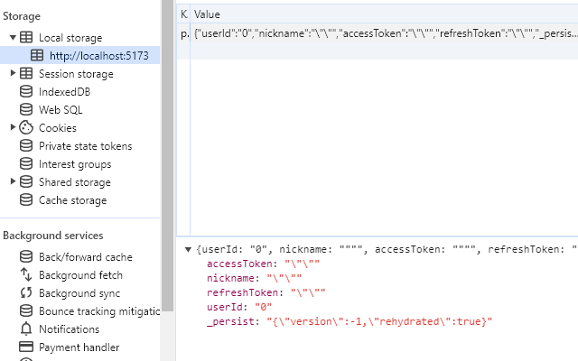

# FE 컨벤션 ✍

**폴더명**: 소문자(+s는 필요에 따라서)

**파일명, 컴포넌트명**: PascalCase

**변수명, 함수명**: camelCase

**API 함수명**: 기능 + 대상 (ex: getArticle(), fetchArticle())

**import 순서**

1. React 컴포넌트 및 훅
2. 외부 라이브러리
3. 내부 모듈 및 컴포넌트

# 💬초기세팅💬

## 호환성

'Vite는 버전 18+ 또는 20+ 의 Node.js를 요구합니다. 다만 일부 템플릿의 경우 더 높은 버전의 Node.js를 요구할 수 있습니다.'

초기 세팅된 컴퓨터의 노드 버전은 v20.10.0 입니다

## 실행방법

```
$ git clone https://lab.ssafy.com/s10-bigdata-recom-sub1/S10P21A604.git
$ cd frontend/
$ yarn
$ yarn dev
```

## 초기 세팅 순서

1. yarn 설치

```
$ npm install -g yarn
```

2. vite + typescript + react 프로젝트 생성

```
$ yarn create vite frontend --template react-ts
$ cd frontend/
```

3. 모바일앱용 pwa 설치

```
$ yarn install -D vite-plugin-pwa
```

4. 상태관리용 redux, redux-persist 설치

```
$ yarn add @reduxjs/toolkit react-redux
$ yarn add redux-persist
```

5. 잔소리꾼 eslint, 예쁘게 prettier 설치

```
$ yarn add -D eslint
$ yarn add -D eslint-plugin-react @typescript-eslint/eslint-plugin @typescript-eslint/parser
$ yarn add -D prettier
$ yarn add -D eslint-config-prettier eslint-plugin-prettier
```

6. css 라이브러리 antd 설치

```
$ yarn add antd
```

7. axios 통신 설치

```
$ yarn add axios
```

#### package.json

```
{
  "name": "sobo-law",
  "private": true,
  "version": "0.0.0",
  "type": "module",
  "scripts": {
    "dev": "vite",
    "build": "tsc && vite build",
    "lint": "eslint . --ext ts,tsx --report-unused-disable-directives --max-warnings 0",
    "preview": "vite preview"
  },
  "dependencies": {
    "@ant-design/icons": "^5.3.0",
    "@reduxjs/toolkit": "^2.2.1",
    "antd": "^5.14.2",
    "axios": "^1.6.7",
    "react": "^18.2.0",
    "react-dom": "^18.2.0",
    "react-redux": "^9.1.0",
    "react-router-dom": "^6.22.1",
    "redux-persist": "^6.0.0"
  },
  "devDependencies": {
    "@types/react": "^18.2.56",
    "@types/react-dom": "^18.2.19",
    "@typescript-eslint/eslint-plugin": "^7.1.0",
    "@typescript-eslint/parser": "^7.1.0",
    "@vitejs/plugin-react-swc": "^3.5.0",
    "eslint": "^8.57.0",
    "eslint-config-prettier": "^9.1.0",
    "eslint-plugin-prettier": "^5.1.3",
    "eslint-plugin-react": "^7.33.2",
    "eslint-plugin-react-hooks": "^4.6.0",
    "eslint-plugin-react-refresh": "^0.4.5",
    "prettier": "^3.2.5",
    "typescript": "^5.2.2",
    "vite": "^5.1.4",
    "vite-plugin-pwa": "^0.19.0"
  }
}
```

## NavBar 참고한 곳

https://github.com/thisuraseniya/Ant-Design-Navbar

## ✨

# 기술 소개

## yarn

Yarn은 JavaScript 패키지 매니저입니다. Node.js 생태계에서 프로젝트의 종속성을 관리하고 패키지를 설치하며, 빌드 프로세스를 용이하게 만들어줍니다. Yarn은 npm과 유사한 기능을 제공하지만, 더 빠르고 안정적으로 동작하며 일관된 설치 프로세스를 제공합니다.

Yarn의 기능과 특징:

1. **패키지 설치와 관리**: Yarn은 프로젝트에 필요한 패키지를 쉽게 설치하고 관리할 수 있습니다. `yarn add` 명령어를 사용하여 패키지를 설치할 수 있습니다.

2. **패키지 버전 관리**: Yarn은 패키지의 버전을 관리하고, 다른 환경에서 동일한 종속성을 설치할 때도 정확히 동일한 버전을 사용합니다.

3. **패키지 캐싱 및 병렬 설치**: Yarn은 패키지를 설치할 때 이전에 이미 설치한 패키지를 캐싱하여 중복 다운로드를 피하고, 여러 패키지를 병렬로 설치하여 설치 시간을 단축합니다.

4. **보안 및 신뢰성 강화**: Yarn은 패키지 다운로드 시 HTTPS를 사용하여 보안을 강화하고, 패키지의 신뢰성을 높이기 위해 패키지의 해시 값을 검증합니다.

5. **잠금 파일 (lock file)**: Yarn은 패키지 설치 과정에서 사용된 정확한 패키지 버전을 기록하는 잠금 파일을 생성합니다. 이를 통해 다른 개발자나 환경에서도 동일한 종속성을 정확하게 설치할 수 있습니다.

Yarn은 JavaScript 프로젝트를 관리하고 패키지를 설치할 때 사용되며, 대부분의 Node.js 기반 프로젝트에서 많이 활용됩니다.

## PWA

#### PWA: Progressive Web App의 약자로, 웹의 장점과 앱의 장접을 결합한 환경

1. 제작방법

- 파일 2개만 사이트 로컬경로에 있으면 브라우저가 PWA로 인식(HTTPS)

```
manifest.json: PWA 매니페스트 파일
service-worker.js: 서비스워커 스크립트 파일
```

1. 특징

- 지원하는 웹 브라우저를 통해 설치 없이 페이지 접속 후 바탕화면에 앱 아이콘 추가 가능
- 언제든 푸시알림을 통해 재참여가 가능
- 오프라인에서도 웹 앱 접근
  - ervice-worker.js 라는 파일과 브라우저의 Cache storage 덕분

참고자료:
[서비스워커개요](https://developer.chrome.com/docs/workbox/service-worker-overview?hl=ko) |
[샘플](https://googlechrome.github.io/samples/service-worker/basic/)

## redux-persist

기존 redux의 경우, 새로고침을 하면 로컬에 저장된 내용들이 사라지는 문제가 있습니다.

Redux Persist는 Redux 상태를 지속적으로 저장하고 복원할 수 있도록 도와주는 라이브러리입니다. 이를 사용하면 앱을 새로고침하거나 다시 열었을 때 Redux 상태를 초기 상태가 아닌 이전에 저장한 상태로 복원할 수 있습니다. Redux Persist는 주로 로컬 스토리지나 AsyncStorage와 같은 저장소에 상태를 저장하는 데 사용됩니다.



## React Query

- src/api/example.ts 파일에 react query 에 관해서 사용법 간단히 정리해둠
- react query는 고유 키를 통해서 그 값을 저장해둔 후 기존의 값에 변화가 없으면 cache에 저장된 값을 불러온다
- 자잘한 기능들은 노션에 정리한거 옮겨야함
