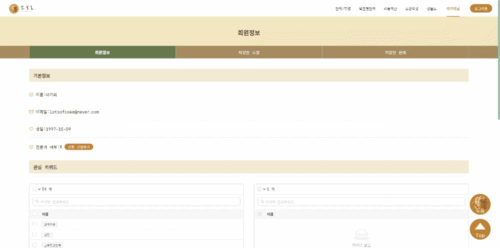
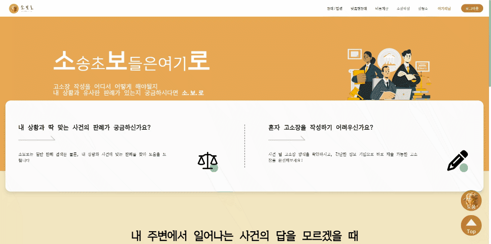
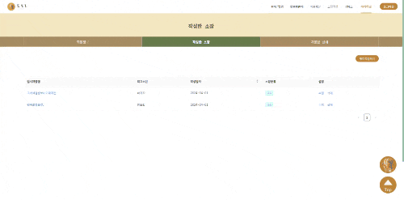
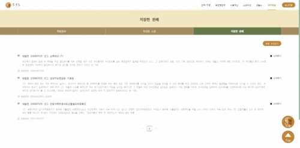
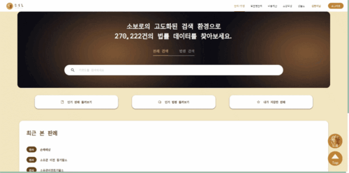
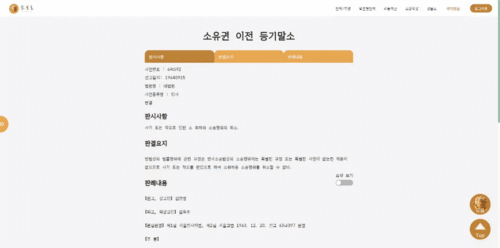
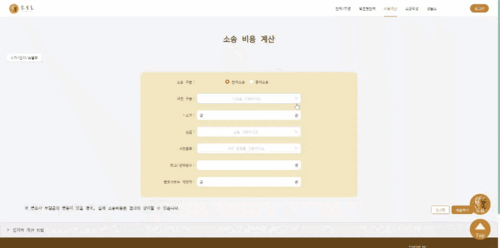
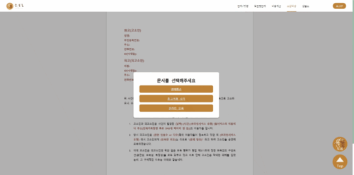
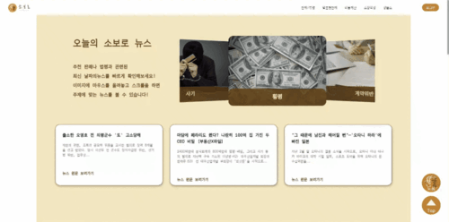

# 소보로(SoboLaw)

#### 소보로(’소’송 초’보’들을 위한 법(law) 지침서)

본 프로젝트는 소송에 휘말린 사용자들에게 자신의 상황과 가장 유사한 판례를 통해 승소 확률을 예측할 수 있는 도움을 제공하는 것을 목표로 합니다. 또한, 소송과 관련된 다양한 기능들을 함께 제공하는 종합 법률 서비스 지원 플랫폼을 제작하는 것입니다.

[서비스 링크](https://j10a604.p.ssafy.io/)


## 목차

1. [**소개 영상**](#1)
2. [**시스템 아키텍쳐**](#2)
3. [**서비스 화면(웹)**](#3)
4. [**서비스 화면(앱)**](#4)
5. [**프로젝트 기간**](#5)
6. [**개발환경**](#6)
7. [**주요기능**](#7)
8. [**프로젝트 관련 문서**](#8)
9. [**개발 멤버 소개**](#9)

<div id="1"></div>

## 소개 영상
🎥 [UCC 보러가기](https://www.notion.so/UCC-5a80f52cef1740d69b4eec4eaf9d9a37)

<div id="2"></div>

## 시스템 아키텍쳐

### 시스템 구성


### ERD


<div id="3"></div>

## 서비스 화면(웹)

### 메인


### 회원

- 로그인 및 회원가입


- 회원 정보 조회


- 회원 등급 수정



- 내가 쓴 소장 조회



- 내가 쓴 소장 상세 조회



- 내가 저장한 판례 조회


- 저장한 판례 상세 조회



### 검색

- 일반 판례 검색



- 인기 판례 및 인기 법령 조회


- 판례 상세 조회 및 요약, 하이라이트 기능



- 맞춤형 판례 검색


- 맞춤형 판례 검색 결과


### 부가기능

- 비용계산 페이지



- 소장작성 페이지



- 상담소 페이지


- 법률용어사전 및 챗봇 컴포넌트


- 법률 뉴스 페이지



### 그 외 페이지

- 관리자의 멤버 조회 및 변호사 신청 승인


<div id="4"></div>

## 서비스 화면(앱)

### PWA(Progressive Web Application) 적용을 통해 모바일앱으로의 동작도 가능하도록 했습니다.

- 메인


<div id="5"></div>

##  프로젝트 기간

### 24.2.19 ~ 24.4.4(7주)

- 기획 및 설계 : 2.19 ~ 2.25
- 프로젝트 구현 : 2.25 ~ 4.1
- 버그 수정 및 산출물 정리 : 4.1 ~ 4.4

<div id="6"></div>

## 개발 환경

#### 전체 구성

| 프로그램 | 버전|
| --- | --- |
| Ubuntu | Ubuntu 20.04.6 LTS |
| Docker | 25.0.4 |
| Docker-compose | 1.29.2 |
| Jenkins | 2.440.1 |
| Jenkins Java | 17 |
| Spring Boot | 3.2.3 |
| Java | Correto-17 java version “17.0.10” |
| Gradle | Gradle-8.5-bin |
| Spring Cloud | 2023.0.0 |
| Querydsl | 5.0.0 |
| Node.js | 20.10.0 |
| Yarn | 1.22.21 |
| React | 18.2.0 |
| Vite | 5.1.4 |
| TypeScript | 5.2.2 |
| Ant Design | 5.14.2 |
| Redux | 2.2.1 |
| MariaDB | MariaDB 11.2 |
| MongoDB | 5.0.6 |
| Redis | 7.2.4 |

---

#### 프론트엔드

- **Node.js (up to 20.10.0)**
  https://nodejs.org/en/download/

```
//package.json
    "@ant-design/icons": "^5.3.4",
    "@ant-design/pro-components": "^2.6.49",
    "@fortawesome/fontawesome-svg-core": "^6.5.1",
    "@fortawesome/free-solid-svg-icons": "^6.5.1",
    "@fortawesome/react-fontawesome": "^0.2.0",
    "@reduxjs/toolkit": "^2.2.1",
    "@types/aos": "^3.0.7",
    "@types/node": "^20.12.2",
    "@types/react-transition-group": "^4.4.10",
    "antd": "^5.14.2",
    "aos": "^2.3.4",
    "axios": "^1.6.7",
    "firebase": "^10.9.0",
    "html2canvas": "^1.4.1",
    "josa": "^3.0.1",
    "jspdf": "^2.5.1",
    "query-string": "^9.0.0",
    "react": "^18.2.0",
    "react-canvas-confetti": "^2.0.7",
    "react-countup": "^6.5.2",
    "react-dom": "^18.2.0",
    "react-icons": "^5.0.1",
    "react-pretty-loading": "^1.0.9",
    "react-query": "^3.39.3",
    "react-redux": "^9.1.0",
    "react-router-dom": "^6.22.2",
    "react-to-print": "^2.15.1",
    "react-transition-group": "^4.4.5",
    "redux-persist": "^6.0.0",
    "swiper": "^11.1.0"

```

### IDE

- **IntelliJ IDEA 2023.3.2**
  https://www.jetbrains.com/ko-kr/idea/download/?section=windows
- **VisualStudio Code (up to 1.86.1)**
  https://code.visualstudio.com/Download

- **DBeaver 23.3.1** 
  https://dbeaver.io/download/


<div id="7"></div>

## 주요 기능 소개

#### 1. 맞춤형 판례 추천

- 내용: 입력한 키워드에 맞춰 TF-IDF분석을 통한 맞춤형 판례 제공
- 사용 기술: fast api, python, 형태소 분석, TF_IDF
- 사용 이유: 판례는 컨텐츠 기반 추천이 적합하다고 생각하였고, 판례마다 중요한 키워드와 가중치를 미리 추출해내어 저장하기 위해 TF_IDF를 사용하였습니다.

#### 2. 일반 판례 및 법령 검색

- 내용 : 검색어를 기반으로 판례와 법령 검색
- 사용 기술 : Elasticsearch
- 사용 이유 : 판매자가 작성한 키워드를 MySQL에서 조회 시 검색 속도 저하,  
  키워드 검색 시 한국어로 필터링이 어려움
- Elasticsearch를 통해 검색 속도 향상 및 score로 필터링하여 정확도 향상
- 한국어 분석기인 nori를 사용하여 한국어 검색 내용 정확도 개선

#### 3. 실시간 알림 기능

- 내용 : 변호사 등업, 상담글 답변글 작성시에 알림 전송
- 사용 기술 : FCM(Firebase Cloud Messaging)
- 사용 이유 : 반응형 디자인, PWA를 접목하여 앱에서의 동작도 고려한 서비스 환경에서 플랫폼에 종속되지 않고 메시지를 전송하기 위해 사용

<div id="8"></div>

## 프로젝트 관련 문서

| 구분      |                                                                                        링크                                                                                        |
|:--------|:--------------------------------------------------------------------------------------------------------------------------------------------------------------------------------:|
| 기획서   |                                                   [기획서 바로가기](https://www.notion.so/f9de39e44297445da8074f63d45ce5de)                                                    |
| 요구사항정의서 |                                                  [요구사항정의서 바로가기](https://www.notion.so/055a755987de4d1db57a00e935238ad3)                                                   |
| 기능명세서   |                                                   [기능명세서 바로가기](https://www.notion.so/27c1c372fda8479fb78d41776fa113f0)                                                    |
| API명세서  | [API명세서 바로가기](https://www.notion.so/API-46be09ec9d6b4e41a3c9a10d161464a6) |
|화면정의서     |                                                      [화면정의서 바로가기](https://docs.google.com/spreadsheets/d/1qCgAPlU9wz-RW0pP60K7Ob6Be6cQOX0YMfgii7YH50U/edit#gid=0)                                                      |
| 와이어프레임    |                                              [와이어프레임 바로가기](https://www.figma.com/file/SUE0cYTv1tI8OXvykMrvUv/SoboLaw's-team-library?type=design&node-id=0-1&mode=design&t=h2IzQjwTPD57neB0-0)                                              |
| 포팅 메뉴얼    |                                                    [포팅 메뉴얼 바로가기](https://www.notion.so/0048c21d34c64f8db1e307aae886149c)                                                    |

<div id="9"></div>

## 👪 개발 멤버 소개

<table>
    <tr>
        <td height="140px" align="center"> <a href="https://github.com/gogoadl">
             <br><br> 👑 김종범 <br>(Back-End) </a> <br></td>
        <td height="140px" align="center"> <a href="https://github.com/jongbum97">
             <br><br> 정소영 <br>(Back-End) </a> <br></td>
        <td height="140px" align="center"> <a href="https://github.com/hrlee12">
             <br><br> 장재성 <br>(Back-End) </a> <br></td>
        <td height="140px" align="center"> <a href="https://github.com/eun-byeol">
             <br><br> 최근영 <br>(Front-End) </a> <br></td>
        <td height="140px" align="center"> <a href="https://github.com/jshEIT">
             <br><br> 김현지 <br>(Front-End) </a> <br></td>
        <td height="140px" align="center"> <a href="https://github.com/com2s">
             <br><br> 조성호 <br>(Front-End) </a> <br></td>
    </tr>
    <tr>
        <td align="center">PM<br>Infra<br/>FCM<br/>MSA 설계<br/>추천 알고리즘
        <td align="center">Elasticsearch<br/>데이터 가공<br/>뉴스 api</td>
        <td align="center">Spring Security<br/>소셜 로그인<br/>JWT<br/>S3<br/>SMTP</td>
        <td align="center">제발</td>
        <td align="center">알려</td>
        <td align="center">줘</td>
    </tr>
</table>
